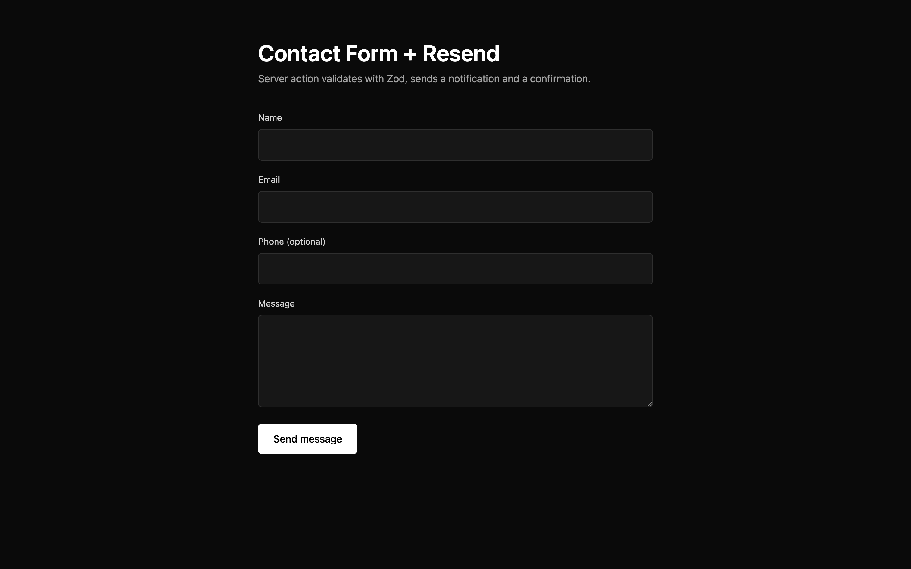

# Resend Transactional Emails Starter

Next.js 14 + Resend + Zod, wired for a real-world contact form flow: validation, notification email to the business, confirmation email to the sender. Templates included, no `react-email` dependency required.



**Live demo:** [resend-transactional-emails-starter.vercel.app](https://resend-transactional-emails-starter.vercel.app)

## What's included

- **Next.js 14** App Router with server actions and `useFormState`
- **Resend** SDK for delivery
- **Zod** validation with per-field error surfacing
- **Two email templates** (notification + confirmation) with luxury dark-and-gold design
- **Auto reply-to** — replies to the notification email go straight to the sender
- **XSS-safe** HTML rendering with entity escaping in templates

## Quick start

```bash
git clone https://github.com/nazirabas/resend-transactional-emails-starter my-forms
cd my-forms
npm install
cp .env.example .env.local
# add RESEND_API_KEY, FROM_EMAIL (verified sender), TO_EMAIL (inbox)
npm run dev
```

Open http://localhost:3000, submit the form. Check both inboxes.

## Environment variables

| Variable | Description |
|---|---|
| `RESEND_API_KEY` | Get from https://resend.com/api-keys |
| `FROM_EMAIL` | Verified sender in Resend (e.g. `hello@yourdomain.com`) |
| `TO_EMAIL` | Where inbound enquiries land (your inbox) |

Until you verify a domain, Resend allows sending from `onboarding@resend.dev` for testing.

## Structure

```
src/app/
  page.tsx          # Contact form with useFormState + useFormStatus
  actions.ts        # submitContact server action
  layout.tsx
src/lib/
  schemas.ts        # Zod validation schema
emails/
  contact.tsx       # HTML/text template renderers
```

## Extending

- **Order confirmations** — add a `renderOrderConfirmation` in `emails/order.tsx`, call from a Stripe webhook route
- **Password reset** — same pattern, add a token in the URL
- **React Email** — swap the string templates for `react-email` components if you want richer previews
- **Attachments** — pass `attachments: [{ filename, content }]` to `resend.emails.send`
- **Scheduled sends** — pair with Vercel Cron for reminder emails

## License

MIT.

---

Built by [Nazir Abbas](https://github.com/nazirabas). Web Developer and SEO Specialist for luxury brands.
